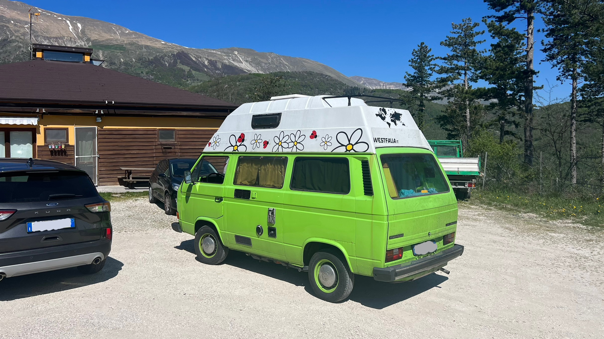

I spent four days in Castelluccio di Norcia, a beautiful village nestled in the mountains of Umbria, together with my friends from [NoName Fly Zone](https://www.instagram.com/nonameflyzone).

Our journey started on Wednesday night. Simone and I left Piacenza right after dark in his green Volkswagen T3 straight out of the 80s. This thing doesn't like going past 90 km/h, but after a couple of hours on the road, we eventually found ourselves in a parking lot along the highway, our improvised stop for the night. At 7am we got back on the road, cruising through the final stretch of the Riviera Romagnola to the sounds of an old Bob Marley cassette. We briefly stopped in Pesaro for a quick coffee break before heading inland toward Castelluccio, finally arriving at the campsite around 9am.

From our campsite, we had a stunning glimpse of Monte Vettore, though nothing could have prepared us for the breathtaking vistas we would soon encounter. After checking in and settling into our accommodations, I had a bungalow, we set off towards Castelluccio.

The road leading to Castelluccio was magnificent, with pine trees and open fields opening up to amazing views as we drove along the winding road.

Entering [Piani di Castelluccio](https://it.wikipedia.org/wiki/Piani_di_Castelluccio) was a sight to behold. Although it was still too early in the year to witness the lentil bloom, which typically paints the plain in vibrant colors between late May and mid-July, the surrounding mountains and hills appeared surreal, their smooth contours seemingly draped in silk.



Sadly, out of the four days, only Friday had good enough conditions for beginners to fly, so I only managed two flights, but that second flight made the whole trip worth it, I thermalled for the first time ever!



In our spare time, we visited Castelluccio and Norcia. It was staggering to see the damage caused by the [earthquake](https://it.wikipedia.org/wiki/Sequenza_sismica_del_Centro_Italia_del_2016-2017) of 2016. Castelluccio remains almost entirely destroyed to this day, with only a few restaurants and bars operating out of prefabricated structures.
