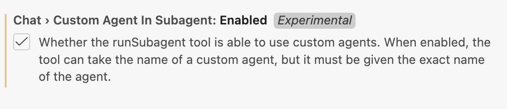

I've been working on a project that aims to automate the research and drafting behind cloud assessment documents.

If you've never had to write one, a cloud assessment is one of those tasks that is as tedious as it is time-consuming. You get access to a client's AWS accounts and start trying to orient yourself, understanding the org structure, mapping cost allocation, figuring out who owns what. You interview the client. You dive into an environment you've never seen before. You run tools like Prowler and Scout Suite to find security and configuration issues, then try not to drown in the ocean of flags those tools spit out. Then, once you've somehow made sense of all of it, you sit down and painstakingly stitch everything together into a formal document.

And the document itself is no small thing. A thorough assessment covers a lot of ground: org structure and landing zone, security posture and logging, networking, FinOps, each with its own standards, priorities, and ways of surfacing what matters. The expertise required isn't just broad, it's deep in multiple directions at once.

Nothing about this process wants to be automated. This is the kind of work that consultants charge a lot for precisely because it resists being written down. A year ago, automating this would have been a fantasy. Not because the steps aren't defined, but because the hardest parts live entirely in the gaps between them. Edge cases aren't the exception here, they are the rule.

Modern LLMs are remarkably capable at operating in this kind of unstructured, judgment-heavy space, but getting there takes more than a single prompt. To handle this kind of complexity you need a system that can decompose the problem, parallelize work, and bring specialized knowledge to bear on each piece, a _multi-agent system_.

## Why a multi-agent system?

Imagine your manager drops by your desk one morning and says: _"Right, so, here's 300 pages of Prowler output, some internal notes from a call that happened six months ago, a contract PDF, a spreadsheet of cost allocation data across fourteen accounts, the client's org structure which nobody has documented properly, you'll need to check their root account MFA, also the SCPs, landing zone setup, VPC peering configs, logging pipelines, whether they're tagging resources correctly for FinOps, their IAM hygiene, oh and there's a compliance framework they mentioned, SOC 2 I think, or was it ISO, anyway figure it out, the networking guy left some notes somewhere, check those too, and we need the draft by Friday."_

All in one breath. No pause. Just a thud as the stack of paper lands on your desk.

You'd be paralyzed, not because you're not capable, but because nobody can hold that much context and act on it coherently at once. After a deep breath you'd start organizing: tackle one thing at a time, build up a picture piece by piece. The complexity doesn't disappear, it gets distributed.

The same thing happens when you hand a single agent a task this broad. Models do their best work when they can focus on one well-defined goal. Pile everything in at once (tool outputs, interview notes, account data, security reports) and [instruction following degrades](https://www.anthropic.com/engineering/effective-context-engineering-for-ai-agents#:~:text=Despite%20their%20speed%20and%20ability%20to%20manage%20larger%20and%20larger%20volumes%20of%20data%2C%20we%E2%80%99ve%20observed%20that%20LLMs%2C%20like%20humans%2C%20lose%20focus%20or%20experience%20confusion%20at%20a%20certain%20point.).

Splitting the problem across multiple specialized agents fixes this. Each agent gets a narrow scope: a [focused system prompt](https://www.anthropic.com/engineering/effective-context-engineering-for-ai-agents#why-context-engineering-is-important-to-building-capable-agents:~:text=Given%20that%20LLMs%20are%20constrained%20by%20a%20finite%20attention%20budget%2C%20good%20context%20engineering%20means%20finding%20the%20smallest%20possible%20set%20of%20high%2Dsignal%20tokens%20that%20maximize%20the%20likelihood%20of%20some%20desired%20outcome.), only the tools it actually needs, only the context relevant to its task. When an agent only has one thing to do, there's room to get into the specifics of *how* it should do it. You can spell out the frameworks it should reference, the edge cases it'll hit, the structure its output needs to follow, which judgment calls it should make and which ones it should escalate. You can't get that level of granularity from a single monolithic prompt, the more ground one agent has to cover, the more your instructions have to stay high-level. Splitting into specialized agents is how you get the granular instruction-following the task actually needs.

Doing so also makes the system modular. Each agent is a self-contained unit. If one isn't performing well, you can tune it and test it in isolation and be confident that changes won't ripple into unrelated parts of the system.

## How to think about building a multi-agent system...

Building a multi-agent system is mostly about thinking through your process in clear, explicit terms, making yourself spell out every assumption, every implicit decision and piece of knowledge that normally goes unexamined. What are the actual steps? Where does one responsibility end and another begin? What happens when you hit an edge case, and who decides?

The moment you try to write it down, you realize how much of your team's process lives as intuition, habit, and shared context rather than anything explicit. Things that feel obvious aren't written anywhere because they never needed to be. They exist in the team's head, passed along through experience and proximity, absorbed gradually by anyone new who spends enough time around it.

We tend to forget that none of this is automagically available to agents. The model doesn't know what you know and doesn't share your assumptions. It hasn't sat in the meetings. Whatever isn't written down doesn't exist, as far as the agent is concerned. So before you can build the system, you have to spell out what the process actually is, and often, in doing so, you realize it was never fully there to begin with.

The framing that helped me most was to deliberately forget about LLMs. I tried to describe the process as if I were staffing it with people. That meant brain-dumping everything: writing detailed responsibilities for each role, spelling out details I'd normally just assume someone would pick up, defining checklists, documenting edge cases. The kind of thorough documentation you'd only ever write if someone's first day depended on it.

If you can't explain what an agent should do to a person, you can't explain it to an agent either. But once you can, writing the system prompt becomes almost mechanical. A side effect of working this way is that you don't just end up with an AI system, you end up with detailed process documentation that probably didn't exist before. The same material that defines the agent's behavior could be handed to a new hire tomorrow and they'd have a clearer picture of the process than most teams ever bother to write down. It's agnostic: a single source of truth that works equally well for humans and machines.

## ...then how to actually do it

Once the process is mapped and the roles are defined, the agents follow pretty naturally. Each role becomes an agent: a system prompt built from everything you wrote down about that responsibility, a set of tools scoped to what the role actually needs. In principle, the design work you already did translates directly. In practice, there's a gap between defining a role and equipping an agent to actually perform it. That gap comes down to two things: how you give the agent the right data, and where it does its work.

In this system, the outermost layer is an **orchestrator**, an agent that doesn't do the assessment work itself but knows the overall plan: which agent runs next, what it receives, what happens with its output. Think of it as the project manager. Below that are the **specialist subagents**, each responsible for one domain of the assessment. In my case, before any of those run, two **briefing agents** go first, one to digest the human context coming into the project (call transcripts, contracts, internal notes), one to do a first pass over the AWS environment itself. Their workpapers then get passed down to downstream agents to build on.

Defining roles and wiring up the orchestration is only half the battle. Once you have agents that need to act on real data, you have to think carefully about what they can access and how they access it. A well-designed agent is useless if it's staring at data it can't reason about.

Take Prowler. Prowler is an open-source tool that audits an AWS environment against hundreds of security and configuration checks. It does its job well. It also produces JSON output files that get very large, very fast. I've seen them hit 200MB for a single account on a moderately complex environment. You can't hand that to an LLM, not without a way to navigate it. The context window fills up, signal drowns in noise, and instruction following degrades in exactly the way I described earlier.

The solution isn't to summarize the data upfront and hope you captured what matters. It's to build the right interface.

I wrote a custom MCP server that sits in front of the Prowler output and exposes it as a set of purposeful operations:
```
prowler_overview — high-level scan stats, severity breakdown, service coverage
prowler_search — free-text search across check codes, titles, descriptions
prowler_check_detail — full details for a specific check code
prowler_check_resources — list failing resources for a check (supports pagination and region/account filters)
prowler_list_by_service — checks grouped by AWS service
prowler_list_by_severity — checks grouped by severity
prowler_list_by_category — checks grouped by Prowler category (e.g. trust-boundaries)
prowler_account_summary — per-account finding summary
prowler_region_summary — per-region finding summary
prowler_services — all AWS services in the scan with check counts
prowler_categories — all Prowler categories with check counts
```
Look at that list as a sequence, not a catalogue. *Give me an overview. Let me search for something specific. Drill into this check. Show me the failing resources, filter by region.* It reads almost like a conversation, and that's not accidental: it mirrors how a human analyst would work through the data. You start wide, orient yourself, then narrow in. The MCP tools are designed around that cognitive flow, not around how the data happens to be stored.

The principle here is: **design tools around how an agent thinks, not around how data is stored.** When designing tooling for agents, the question to ask isn't "how do I expose this data?" but "how would a good analyst actually work through this?" If the tools read like a natural workflow, the agent will use them in the right order, at the right level of detail, without being explicitly told the sequence.

What I found is that this encourages the agent to explore the data almost with curiosity: following a thread because it looks worth following, drilling deeper into a finding that seems significant, ranging across different angles before settling on what matters. It doesn't treat every data point with the same flat level of attention. It prioritizes and investigates. This quality of engagement is very hard to prompt directly, but it emerges almost naturally when the tooling makes it easy to explore.

This applies to any data source your agents need to work with. Wherever there's a gap between how data is stored and how an agent needs to think about it, that's where a purpose-built tool belongs.

## The agent workspace

A system prompt and a set of tools define *what* an agent can do. The workspace defines *where* it does it.

Think about what a consultant's desk looks like when they sit down to do this kind of work. It isn't empty. There's a laptop open to the client's environment, a notepad for jotting things down, a template with the sections already blocked out, maybe a checklist pinned to the side. 

The agent workspace is that desk, made concrete as a filesystem. Each subagent gets its own folder, set up before the run begins, in the right state, with the right files already in place. 

In my project, every "pillar" agent gets three files:

```
./pillar-security/
  scratchpad.md
  findings.md
  section-draft.md
```

`scratchpad.md` is the notepad. Notes, intermediate analysis, raw data extracts pulled from tools, threads worth following, anything the agent needs to hold onto while it's working. This is where thinking happens before it gets shaped into anything presentable. Looking at a scratchpad mid-run is one of the fastest ways to understand what the agent is actually doing and where it's getting stuck.

`findings.md` is the workpaper. Detailed internal documentation that supports the final report but never gets published. Written for the team, not the client: precise, technical, complete. Every finding gets an ID, a severity, and a full technical description. This is the record of what the agent actually found.

`section-draft.md` is the client-facing deliverable, what eventually gets assembled into the final assessment. The distinction between this and the workpaper matters. The findings file captures everything with full technical fidelity. The section draft translates that into something a client can actually read: contextualized, prioritized, actionable, with the internal scaffolding stripped out. Same substance, different audience.

The section-draft files don't start empty. They arrive at the agent's desk already structured, pre-compiled with the sections blocked out and markdown comments telling the agent exactly what goes where:

```markdown
## Findings

<!-- Each finding follows this structure:

### Descriptive Title (CST00N)

**Why It Matters:** Paragraph explaining the significance — what risk it creates, 
what business impact it has, why the client should care.

**Findings:** Paragraph presenting evidence from the environment. Quantify with 
plain language (counts, percentages, estimated savings). No Prowler check codes or ARNs.

**Suggested Remediations:**
- Concise, actionable recommendation — quick wins first, then strategic improvements
```

This pre-filled template does more work than it looks like. You're not just telling the agent what to write, you're showing it *in situ* what the output should look like. Pre-filling the deliverable file is worth doing pretty much universally. A blank file and a formatting instruction in the system prompt are not the same thing. Instructions get diluted by the time the agent is deep in a task; structure embedded directly in the file stays visible throughout. Think of it less as a template and more as a standing expectation, the agent can see exactly what "done" looks like before it starts. It constrains and guides at the same time.

The specific files will look different for every use case, but the logic is the same: before an agent runs, figure out what it needs on its desk. What does it need to hold onto while it's thinking? What's the internal record it should leave behind? What's the final output, and what shape should it arrive in?

## The workflow builder
Time to sit down and actually build the thing, which means picking an environment to build in.

The landscape of AI coding tools right now is almost comically crowded. From Claude Code to Gemini CLI and OpenCode, from Cursor to Antigravity and Windsurf. I ended up going with VS Code and GitHub Copilot. Out of everything I tried, it felt like the one with the best "model harness" and subagent implementation, and generally the most featureful and easy to use. [Claude Code's implementation](https://code.claude.com/docs/en/sub-agents) looks solid (might be better, but my company doesn't have a subscription), and Gemini CLI has [experimental subagent support](https://geminicli.com/docs/core/subagents/) in the works.

The first agent I created wasn't one of the assessment agents. It was a meta-agent, the **workflow builder**. Its job is to help me build and evolve the system: creating agent prompts, scaffolding workspaces, writing tools. Before any assessment agent existed, the workflow builder existed, and I used it to design and implement everything else.

Its system prompt contains a full map of the system it builds: every agent, every workspace, every tool. The agent needs an accurate picture of what already exists to make good decisions about what to build or change next. It's also responsible for keeping that map current, including **updating its own prompt when the system evolves**. An agent whose job description includes maintaining its own job description is a strange thing, but it works: the prompt (together with supporting documents like `ARCHITECTURE.md`) becomes a living document that grows with the project rather than a static spec that goes gradually stale overtime.

## The feedback loop

Once the system starts producing something that resembles a real output, your work changes. You're no longer designing in the abstract, you're reviewing actual generated assessment sections and asking: *is this good enough?* At first the answer is no, and the gap between what you got and what you wanted will tell you where to look.

What comes next almost resembles RLHF: you run the system, read what comes out, critique it, implement changes, run it again. The workflow builder agent is useful here, once you know what needs to change, you describe the problem and let it make the edits. Then you try again.

The hard part isn't the loop itself. The hard part is coming up with good feedback. You need to articulate precisely what's missing and why, specific enough that the change you're asking for is unambiguous. "This section is bad" doesn't help. "This section doesn't mention the client's existing tagging strategy before recommending a new one" does.

Modern models are very steerable. When output quality plateaus, the bottleneck is almost never the model, it's the instructions. The gap between a mediocre output and a good one is almost always a gap in what you asked for.

## Under the hood: how subagents actually work

At the implementation level, a subagent invocation is the simplest kind of tool call there is. The orchestrator calls `runSubagent` with a prompt and a description (the description is purely cosmetic, it's what the chat UI shows to indicate something is happening). A fresh context spins up, the subagent thinks, calls whatever tools it needs, and when it's done, its final message gets passed back to the calling agent as output.

Each subagent starts from zero. Whatever the orchestrator knows, whatever previous agents produced, none of it exists unless explicitly passed in. This is another place where our [filesystem-as-state pattern](https://agentic-patterns.com/patterns/filesystem-based-agent-state/) helps. Rather than cramming everything into the invocation prompt, agents write their outputs to workpapers and downstream agents read what they need, much more token-efficient than passing the full context chain through every invocation.

One thing I ran into: by default, `runSubagent` doesn't let you reference an existing agent from your `.github/agents/` folder. In practice this means the orchestrator has to read each agent's system prompt from file and summarize it into a new prompt on the fly, every time. This is both wasteful and lossy. You spent time writing precise system prompts for each subagent, only to have the orchestrator paraphrase them on every invocation, burning context and losing fidelity.

The fix is to set this experimental feature flag. Add this to your workspace settings:



```json
"chat.customAgentInSubagent.enabled": true
```

Once enabled, `runSubagent` accepts an `agentName` argument, and the subagent runs with its own full system prompt.

How did I find the full `runSubagent` signature in the first place? I just asked the model to tell me!

## Debugging: looking inside the run

The VS Code chat UI gives you a surface-level view of what's happening. You can see agents being invoked, tool calls firing, outputs coming back. Enough to follow along, but not enough to diagnose problems.

Two things helped me here.

First, the Chat Debug View (`>Developer: Show Chat Debug View` in the command palette). This shows the raw contents of every LLM request made during the session: the actual system prompt, the full message history, the tool definitions, everything. What surprised me when I first opened it was how much Copilot agent mode adds to the system prompt before your instructions even begin. **A single "Hello world" prompt balloons to roughly 5,000 tokens** after Copilot prepends its own scaffolding (workspace structure, tool instructions, formatting rules, agent lists). That overhead is there on every request, whether you're running a quick test or a full assessment. Worth knowing.

Second, the Chat Export (`>Chat: Export Chat...`). This dumps the full session as a JSON file. The raw JSON isn't exactly readable, so I wrote a [small Python script](https://gist.github.com/ferraridavide/07e1e20ae4a644814997af41d6596816) to extract and format the important parts into something you can actually read through. Running that after a full assessment run is one of the quickest ways to understand what actually happened: where an agent went off-script, where a subagent produced something unexpected that silently propagated downstream, or where the system did something surprisingly good that you might want to reinforce.

## Where this leaves things

The system works. Not perfectly, but well enough that I'm using it on real assessments now. The agents generate sections that need editing but rarely need full rewrites. They catch things I would've caught and sometimes things I would've missed. The quality isn't quite at "ship it unchanged," but it's getting close.

What still needs work is consistency. Some runs produce great output, others go sideways in interesting ways. An agent will fixate on something minor, or miss something obvious because it didn't think to check. Part of that is prompt tuning. Part of it is probably just the nature of the beast, LLMs are probabilistic and multi-agent systems compound that. I'm still figuring out where the ceiling is.

The interesting question is whether this approach generalizes. Cloud assessments have structure: known frameworks, repeatable analysis patterns, clear deliverable formats. I suspect a lot of knowledge work shares those properties, but I also suspect there are domains where this breaks down completely. Time will tell.

If you're building something similar, [agentic-patterns.com](https://agentic-patterns.com/) is worth a look. That's where a lot of the patterns I used here came from.