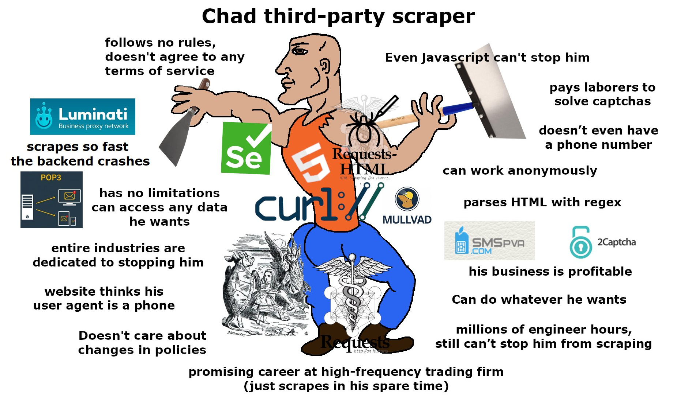

I joined Instagram on May 7, 2011. Back then, it was a simple place. The good old days of slapping a "Nashville" filter on a blurry photo of your sandwich, posting it with a handful of hashtags, and scrolling through a chronological feed of square photos from a few friends are long over.

<center></center>

Fast forward to today, and what's left is a wasteland of sponsored posts, brain-washing short-form content, brainrot memes, and maybe, if you're lucky, at the end of it all, a friend's post from their trip. I just wanted to see what my friends were up to. Instead, I'm three minutes deep watching someone cutting kinetic sand while a Minecraft parkour video plays underneath and a metallic voice narrates a Reddit thread about a guy who found a secret room in his basement. Ugh.

I find myself deleting and reinstalling the app every so often. When the straw breaks the camel's back, I delete it, feel good about it for a couple of days, then start feeling like I am missing out, redownload it, lose two hours to the scroll-hole, and swear I'll delete it again tomorrow. Rinse and repeat.

What I realized is that it's not the Reels or the posts I'm missing. The Reels I'm just better off without, and the posts are always there when I get back. The real evil? Stories. You have 24 hours to catch up or they are gone. This creates a sense of urgency, it's a mechanism designed to perpetually pull you back because if you don't check, you might miss something. It's a constant mental itch I can't quite scratch which is exactly what keep me going back.

The irony is that Instagram actually [added back the chronological feed for regular posts in 2022](https://about.instagram.com/blog/announcements/favorites-and-following), which at least was a step in the right direction, if only it wasn't buried in some menu without the ability to make it the default. They even added a ["You're All Caught Up"](https://about.instagram.com/blog/announcements/introducing-youre-all-caught-up-in-feed) feature, I remember seeing it years ago, but with all the suggested content they have added over the years, I haven't seen it in forever. Posts are always there whenever you feel like checking them, no pressure. Stories, though? They remain the ultimate retention trap.

I wished there was a way to keep the stories without the stress. So, like any self-respecting developer with too much free time, I built Slowgram: a way to catch up with Stories on my own terms and serve them to me in a clean, distraction-free interface. Let's get scraping.

## How It Works

The setup is straightforward: two Docker containers. One runs [Browserless](https://github.com/browserless/browserless) (headless Chrome), the other runs the Playwright scraper on a cron schedule (four times a day) and serves the React viewer.

### Why Scrape Instead of Using APIs?

When I started thinking about how to grab stories, the obvious approach would be reverse engineering Instagram's API. Grab the endpoints, figure out the auth, make some requests. But I had a feeling Instagram probably has some pretty good systems in place to detect anomalies and improper use of their services. Every API call is a potential red flag, unusual patterns, missing headers, weird timing, hitting endpoints in ways a real user wouldn't.

So I went the opposite direction: act like a real user. Use a real browser, log in once, and just... watch. No API calls to reverse engineer, no suspicious request patterns. I'm literally just opening Instagram and letting stories play, like anyone else would.



### Staying Logged In

To make this work, the browser needs to stay logged in between runs. We mount a volume for the Chrome profile and point Playwright at it with `--user-data-dir`. Login once, persist the session forever.

```python
async def _setup_local_browser(self):
    print(f"Launching Chrome with profile: {self.profile_dir}")
    self.context = await self.playwright.chromium.launch_persistent_context(
        str(self.profile_dir),
        accept_downloads=True,
        headless=False,
        viewport={'width': 540, 'height': 960},
        args=[]
    )
```

### Wait, Don't Click

Once I'm in, the strategy is simple: [do nothing](images/do_nothing_win.jpg). I don't click "Next." I don't swipe. Every interaction generates telemetry: mouse movements, click timing, scroll patterns. Instagram watches for that stuff.

Instead, I open the first story and literally just wait. Instagram auto-advances to the next one. The Playwright script just sits there until the URL changes away from `/stories/`:

```python
await self.page.wait_for_url(lambda url: "stories" not in url, timeout=0)
```

Minimum interaction, maximum stealth.

### Grabbing Videos

Now for the actual downloading. Photos are easy, they're just `img` tags in the DOM. Videos? That's where it gets interesting.

Instagram uses [Media Source Extensions](https://developer.mozilla.org/en-US/docs/Web/API/Media_Source_Extensions_API). There's no `.mp4` URL sitting in the DOM. The video streams in chunks. My first thought was to grab the requests from the network tab and replay them. But that means making duplicate requests. Instagram downloads the video once for playback, and I'd be downloading it again for saving. More requests, more patterns, higher chance of getting flagged.

So instead, I hook into the stream itself. I inject a script that monkey-patches `URL.createObjectURL` and `MediaSource.addSourceBuffer` to capture the chunks as Instagram downloads them, without making any extra requests:

```javascript
const originalCreateObjectURL = URL.createObjectURL;
URL.createObjectURL = function(obj) {
    const url = originalCreateObjectURL.call(URL, obj);
    
    if (obj instanceof MediaSource) {
        const originalAddSourceBuffer = obj.addSourceBuffer;
        obj.addSourceBuffer = function(mime) {
            const buffer = originalAddSourceBuffer.call(this, mime);
            const bufferData = { mime: mime, chunks: [] };
            
            msToBuffers.get(obj).buffers.push(bufferData);
            
            const originalAppend = buffer.appendBuffer;
            buffer.appendBuffer = function(data) {
                bufferData.chunks.push(new Uint8Array(data));
                return originalAppend.call(this, data);
            };
            return buffer;
        };
    }
    return url;
};
```

When the stream ends (`sourceended` event), we reconstruct the blob from all the captured chunks and trigger a download. While we're at it, we check for "Sponsored" labels in the DOM and drop those chunks entirely:

```javascript
obj.addEventListener('sourceended', () => {
    const sponsoredSpans = document.evaluate(
        "//span[text()='Sponsored']", 
        document, 
        null, 
        XPathResult.ORDERED_NODE_SNAPSHOT_TYPE, 
        null
    );
    for (let i = 0; i < sponsoredSpans.snapshotLength; i++) {
        // if visible, drop the chunks
    }
    // else trigger download
});
```

### Photos

For photos, a `MutationObserver` watches for new `img` elements as stories auto-advance. We dedupe by base URL (stripping query params) and trigger downloads:

```javascript
window.mutationCallback = async (mutation) => {
    for (const node of mutation.addedNodes) {
        if (node.nodeType !== 1) continue;
        
        const img = node.matches('img[src*="cdninstagram.com"][alt*="Photo by"]')
            ? node
            : node.querySelector('img[src*="cdninstagram.com"][alt*="Photo by"]');
        
        if (img) {
            const baseUrl = img.src.split('?')[0];
            if (downloadedUrls.has(baseUrl)) continue;
            downloadedUrls.add(baseUrl);
            
            triggerDownload(img.src, ...);
        }
    }
};

const observer = new MutationObserver((mutationList) => {
    for (const mutation of mutationList) {
        window.mutationCallback(mutation);
    }
});

observer.observe(document.body, { childList: true, subtree: true });
```

### The Viewer

Instagram's UI is built around tunnel vision: one story at a time, full screen, auto-advancing. You're either watching or you're not. There's no way to just glance.

Slowgram flips this. I built a React frontend that lays everything out as a flat gallery, organized by user. All stories in a grid, like a photo album. You can take in everything at once, spot what looks interesting, skip what doesn't.

I even added an hover-to-scrub feature on videos. Move your cursor from left to right across a video thumbnail, and it scrubs through the timeline. You can skim through a 15-second video in half a second and decide if it's worth your time. No clicking, no committing, just a quick peek.

```jsx
const handleMouseMove = (e) => {
    if (story.type !== 'video' || isPlaying || !videoRef.current || duration === 0) return;
    
    const rect = e.currentTarget.getBoundingClientRect();
    const x = e.clientX - rect.left;
    const percentage = x / rect.width;
    
    videoRef.current.currentTime = percentage * duration;
};
```

Added lazy loading with `IntersectionObserver` to keep things snappy even with hundreds of stories:

```jsx
useEffect(() => {
    const observer = new IntersectionObserver(
        ([entry]) => {
            if (entry.isIntersecting) {
                setIsVisible(true);
                observer.disconnect();
            }
        },
        { rootMargin: '100px' }
    );
    observer.observe(container);
    return () => observer.disconnect();
}, []);
```

Also threw in a favorites feature using `localStorage` so close friends bubble to the top.

It's been running autonomously for a while now. Scraper wakes up four times a day, watches the feed, downloads new stories, goes back to sleep. I get to see what my friends are up to, but on my terms, in my own UI, without the algorithmic chaos.