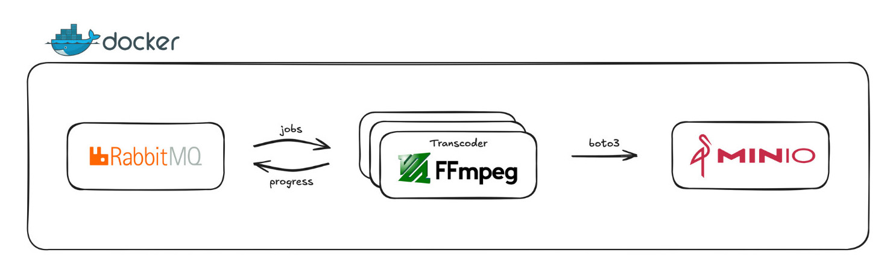
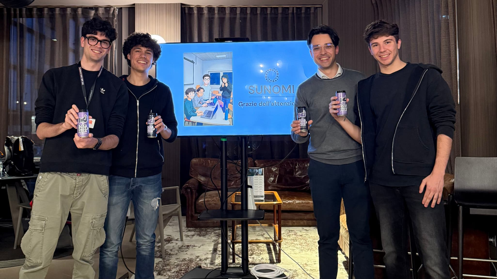

Just a few months ago, AWS felt like a distant, complex universe. Today, I'm writing this having just presented our very own cloud-native video platform, Sunomi, at the [AWS User Group in Milan](https://www.meetup.com/awsusergroupmilano/events/306974692/). The journey from a university project concept to standing on that stage has been an incredible crash course in cloud computing, teamwork, and problem-solving.

It all started last September when Andrea, Federico, Alessandro, and I, fellow Computer Engineering Master's students at the University of Pavia, enrolled in the Cloud Computing course. The final project? Build something substantial on AWS. None of us had any significant prior experience with AWS, and frankly, the prospect was a little daunting. But the challenge was exciting.

We knew we wanted to tackle something complex and real-world. A video sharing platform, mimicking core YouTube functionalities, seemed like the perfect fit. It involved user management, data storage, content processing (the tricky part!), and delivering it efficiently – all prime candidates for cloud solutions.

## The First Steps: Building Locally

Since we didn't yet have our AWS credits and were wary of accidentally racking up a massive bill (Alessandro's credit card is safe, thankfully!), we decided to start with a local proof of concept, simulating a cloud environment using Docker and Docker Compose.

Our initial focus was the transcoder – the heart of any video platform. This component takes an uploaded video and converts it into various resolutions and formats optimized for streaming, specifically using the HLS (HTTP Live Streaming) protocol. We built it in Python, leveraging FFmpeg through a wrapper library. To simulate cloud services, we used MinIO (an S3-compatible object storage) and RabbitMQ (for message queuing), allowing us to practice with libraries like `boto3` (the AWS SDK for Python) from day one, ensuring a smoother transition later. This local setup was crucial for rapid iteration and understanding the core video processing pipeline without the complexities and costs of the cloud initially.

We also laid the groundwork for the rest of the platform: a React/TypeScript frontend and a Node.js/Fastify backend (the "controller"). We focused on building these with cloud-native principles in mind, opting for a microservices-like structure and stateless authentication with JWTs, knowing we'd eventually deploy them to scalable AWS services. We even used tools like Prisma ORM for type-safe database interactions and OpenAPI (Swagger) to generate the frontend API client automatically – small wins that made development much smoother.

## Entering the Cloud: The IAM Houdini Puzzle

When we finally got our AWS credits, it was like stepping into Willy Wonka's factory of cloud services – dazzling, overwhelming, and full of possibilities. Then we hit the chocolate river of IAM permissions, and the sugar rush turned into a sticky mess. IAM roles and policies became our first major hurdle. It felt like a never-ending puzzle, tweaking JSON policies, assigning roles, only to be met with "Access Denied" errors. After hours spent poring over documentation and Stack Overflow, our persistence paid off. Learning to navigate IAM, understanding the difference between users, roles, and policies, and figuring out who needed access to what became a fundamental skill we gained early on. It was frustrating, but incredibly valuable.

## Embracing the Serverless Mindset

Our biggest mindset shift happened when we transitioned from our local setup to AWS. Up until that point, our thinking about computing was very…physical. We were used to thinking in terms of where our code would run – which server, which container, how many CPU cores, how much memory. Even in our local infrastructure, with Docker and Docker Compose, we were still mentally mapping our services to these physical (or virtual) boxes. RabbitMQ, for example, was our message queue, running in our Docker environment.

So, naturally, when we first started exploring AWS, our initial instinct was to replicate this setup. We thought, "Okay, we need a message queue. AWS MQ looks like RabbitMQ – let's use that." We were still anchored to the idea of managing the infrastructure ourselves, albeit on AWS.

Then came the serverless epiphany.

It was a gradual realization, a series of "wait, what?" moments as we discovered the power of Lambda functions, SNS, and ECS Fargate. The idea of writing code that just runs without provisioning servers, scaling automatically based on demand, it felt almost too good to be true.

I vividly remember the conversation we had about the transcoder. We were discussing how to scale it on AWS and someone said, half-jokingly, "Can we really just launch any number of ECS Fargate transcoding tasks and not worry about how that scales?" The thought was almost absurd. We were so used to thinking about resource constraints, load balancing, and all the nitty-gritty details of managing infrastructure. But the answer, surprisingly, was _yes_. That's the power of serverless. It abstracts away the underlying infrastructure, allowing us to focus purely on the logic of our application.

That shift, from thinking about where our code runs to how it runs, was pivotal. It unlocked a whole new way of designing and building applications, a truly cloud-native approach. It was like taking off a heavy backpack we didn't even realize we were carrying. RabbitMQ, running on a dedicated server (even a virtual one), suddenly seemed archaic compared to the elegance of an event-driven model. Using a combination of S3 event notifications triggering SNS messages, which then invoked Lambda functions to launch ECS Fargate tasks for transcoding, transcription (AWS Transcribe), and content moderation (AWS Rekognition), became our new, elegant, and scalable solution. A video upload to S3 would set off this chain reaction, effortlessly scaling to handle any number of uploads concurrently. It was serverless in action, and it changed everything.

## The Unforeseen Hurdles: Tales from the Trenches

No cloud computing project comes without its thunderstorms. A few stand out:

### The PID 1 Problem
After spending time understanding the core ECS concepts – Tasks, Task Definitions, and Services – we were eager to deploy our first container on Fargate. Instead of immediately deploying our transcoder image, we decided to take a cautious first step: launching a simple Ubuntu Docker image with SSH access. The goal was straightforward: verify networking, security group rules, and ensure we could connect and interact with AWS services from within the container.

We successfully deployed the Ubuntu task and managed to SSH into the running container. Success! Or so we thought. Our next simple test was to list files in an S3 bucket using the AWS CLI (`aws s3 ls`). To our confusion, it failed with an "Access Denied" error. We double-checked the IAM Task Role attached to the task – it was correctly configured with the necessary S3 permissions according to the AWS console. The role was right, the container was running, the network seemed fine (we could SSH in), but the container couldn't access S3.

This sent us down a frustrating rabbit hole. After extensive searching and head-scratching, [we stumbled upon a crucial piece of information buried in the documentation and forums](https://repost.aws/knowledge-center/ecs-iam-task-roles-config-errors): the `AWS_CONTAINER_CREDENTIALS_RELATIVE_URI` environment variable, which the ECS Agent injects to allow the container's processes to fetch temporary credentials associated with the Task Role, is **only available to the process running as PID 1** inside the container. In our specific Ubuntu container setup, the main process was running as PID 1, but our interactive SSH session and the bash shell we were using were running as a different process, *not* PID 1. This meant our shell simply didn't have access to the environment variable telling it where to find the credentials.

Fixing this was just a matter of re-exporting the environment variable in the Dockerfile, or just simply running an image that actually runs our application as the entrypoint of the container.
### The Firewall Strikes Back
We lost a significant amount of time trying to access the controller's endpoint from the university network. After debugging everything from security groups to load balancer configurations, we discovered the university firewall was simply blocking the specific port (3000) used by our service. A simple hotspot test revealed the frustrating truth. Lesson learned: always suspect the network!
### Pre-signed URL Proxying
In our local Docker setup, the controller generated MinIO pre-signed URLs that were only valid within the Docker network. The frontend, running outside this network, couldn't use them. We solved this by introducing an Nginx reverse proxy to correctly map external requests to the internal Docker hostnames, allowing seamless uploads from the frontend. This was a creative workaround born out of local development constraints.

These moments, while stressful at the time, were invaluable learning experiences that forced us to dig deep and understand the underlying mechanisms.

## More Than Just Code: The Power of Teamwork

Building Sunomi wasn't just a technical exercise; it was a masterclass in teamwork and a highlight of my university experience. Those days spent side-by-side with a passionate and determined group, tackling problems, sharing laughs, and yes, pulling a few all-nighters, transformed this project into something far more meaningful than just a university assignment. It allowed us to experience aspects of university life that extend beyond textbooks and lectures, aspects I've rarely felt so strongly in other projects. It was a chance to truly bond over a shared challenge, build lasting connections, and see the direct impact of our collective effort.

Each of us brought different strengths to the table: Andrea's focus on infrastructure automation, database reliability, and CI/CD robustness; Federico's contributions to backend models, schema design, and queueing systems; Alessandro's dedication to frontend UX features and styling; and my own focus on overall architecture, AWS infrastructure, CI/CD, and full-stack feature implementation. I'm particularly proud of having the opportunity to guide the group in those initial technical decisions. Putting myself in that leadership role, learning alongside classmates with whom I'd developed a strong rapport, was invaluable.

We learned to leverage each other's skills, debate architectural decisions constructively, support one another through frustrating bugs and roadblocks, and maintain momentum even when things felt overwhelming. It was in those moments of shared struggle and eventual triumph that the true strength of our team became clear.

## The Culmination: Sharing Our Story

Presenting Sunomi at the [AWS User Group in Milan](https://www.meetup.com/awsusergroupmilano/events/306974692/) felt like the perfect culmination of this intense learning journey. Standing on stage, sharing our experiences, the challenges we faced, and the lessons we learned, was incredibly rewarding. It validated the countless hours spent coding, debugging, configuring, and debating.

Sunomi is more than just a video platform. It's a demonstration of what four dedicated and hard-working students can accomplish when they combine their skills, passion, and a healthy dose of caffeine. We started with little AWS experience, but we finished with a working platform, a wealth of knowledge, a profound appreciation for the power and complexity of cloud computing, and a shared sense of accomplishment that will stay with us long after graduation.

You can find Sunomi at [sunomi.eu](https://sunomi.eu/), but just in case we ever forget to renew our fancy $3/year domain, it'll always be hanging out at [davide.im/sunomi](https://davide.im/sunomi/)